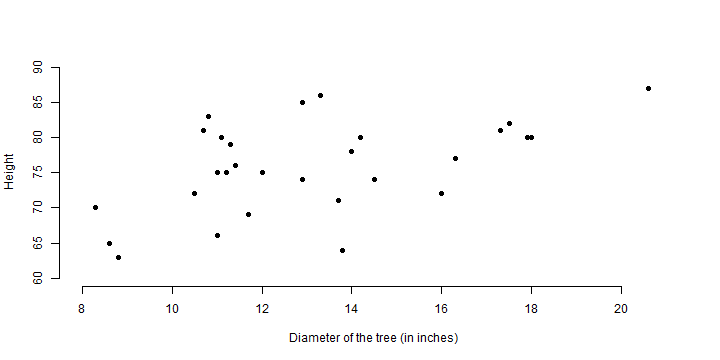

## Image you have a Black Cheery Farm

### Woudn't it be a good idea to control the tree height?

- Be it to use the timber to make furniture
- Be it to do a tree farm landscaping
- Be it to utilise some farming automation

---

## The Key is Data

We've got a data set called 'trees'. It provides measurements of the girth, height and volume of timber in 31 felled black cherry trees. Note that girth is the diameter of the tree (in inches) measured at 4 ft 6 in above the ground. (from: http://stat.ethz.ch/R-manual/R-devel/library/datasets/html/trees.html)

---

## What is found 

> - Girth is between 8 and 21
> - Height is between 60 and 90
> - The bigger the Girth is, the higher the Height is
> - It is close to a linear relation

---

## Thank You!

